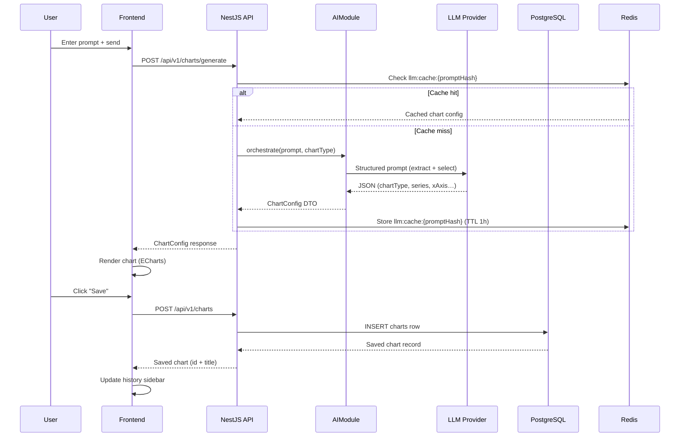

# Architecture Spec — Charts Generator

## 1. System Architecture

### 1.1 System Diagram

```
┌─────────────────────────────────────────────────────────────────┐
│                          Browser                                │
│                     Next.js Frontend (SSR)                      │
│         (React + TypeScript + Design System + i18n)             │
└──────────────────────────┬──────────────────────────────────────┘
                           │ HTTPS / REST API
┌──────────────────────────▼──────────────────────────────────────┐
│                   NestJS API Server                             │
│   ┌──────────┐ ┌──────────┐ ┌──────────┐ ┌──────────────────┐  │
│   │   Auth   │ │  Charts  │ │    AI    │ │     Export       │  │
│   │  Module  │ │  Module  │ │  Module  │ │     Module       │  │
│   └──────────┘ └──────────┘ └──────────┘ └──────────────────┘  │
└──────┬──────────────┬──────────────┬───────────────────────────┘
       │              │              │
┌──────▼──────┐ ┌─────▼──────┐ ┌────▼──────────────┐
│ PostgreSQL  │ │   Redis    │ │   LLM Provider    │
│  (primary)  │ │  (cache)   │ │ (OpenAI-compat.)  │
└─────────────┘ └────────────┘ └───────────────────┘
```

### 1.2 Frontend / Backend Split

| Concern          | Responsibility                                            |
|------------------|-----------------------------------------------------------|
| Frontend         | UI rendering, state management, chart rendering, i18n     |
| Backend          | Auth, business logic, AI orchestration, data persistence  |
| LLM Provider     | Data extraction, chart type selection, structured output  |

### 1.3 Service Boundaries

- **Frontend** never calls the LLM provider directly — all AI requests go through the backend.
- **Backend** is stateless; all shared state (sessions, cache) lives in Redis.
- **Export** (image generation) runs server-side to avoid browser compatibility issues.

### 1.4 System Modules

| Module       | Responsibility                                             |
|--------------|------------------------------------------------------------|
| AuthModule   | Registration (email), login, JWT issue/refresh, password   |
| ChartModule  | CRUD for saved charts, chart history per user              |
| AIModule     | Prompt ingestion, LLM call, structured output, chart config|
| ExportModule | Server-side chart-to-image rendering (PNG/SVG)             |

---

## 2. Frontend Architecture

### 2.1 UI Architecture Model

The frontend uses a strict 4-layer system. Each layer has a single responsibility and may only depend on layers below it.

```
┌──────────────────────────────────┐
│         Page Layer               │  Business pages (e.g. /dashboard, /login)
├──────────────────────────────────┤
│        Pattern Layer             │  Reusable layout compositions (AppLayout, SplitLayout…)
├──────────────────────────────────┤
│       Component Layer            │  Atomic / molecular UI components (Button, Input, Card…)
├──────────────────────────────────┤
│         Token Layer              │  Design tokens: color, spacing, typography, radius, shadow
└──────────────────────────────────┘
```

**Token Layer**
- Source of truth for all visual constants.
- Defined as CSS custom properties and TypeScript constants.
- No layer above may hard-code a color, spacing value, or font size.

**Component Layer**
- Atomic and molecular components built exclusively from tokens.
- Stateless where possible; accept data and callbacks via props.
- Every component supports the standard state model (see §2.5).
- No business logic; no API calls.

**Pattern Layer**
- Composes components into reusable layout structures.
- Abstract — patterns are NOT named after product features.
- Pages import patterns; patterns do not import pages.

**Page Layer**
- Composes patterns and components to build product screens.
- Handles routing, data fetching (via hooks/server components), and i18n.
- Contains zero style definitions.

---

### 2.2 Design System Strategy

**Location:** `packages/design-system/`

```
packages/design-system/
├── tokens/          # CSS variables + TS token exports
├── components/      # Atomic + molecular components
├── patterns/        # Layout pattern components
└── index.ts         # Public API barrel export
```

**Consumption:** All application code imports exclusively from `@charts-gen/ui`, which resolves to `packages/design-system/index.ts` via monorepo path alias.

```ts
// Allowed
import { Button, AppLayout, tokens } from '@charts-gen/ui';

// Forbidden
import SomeComponent from '../../design-system/components/SomeComponent';
```

**Extensibility Rules:**
1. New tokens, components, or patterns are added to `packages/design-system/` — never inline in application code.
2. Existing public APIs are never modified in a breaking way; new props/variants are additive only.
3. A component or pattern MUST exist in the design-system before any page or feature may use it.
4. Deprecated items are marked `@deprecated` and kept for one release cycle before removal.

---

### 2.3 UI Control Boundaries

These rules are hard constraints enforced via Cursor rules and code review:

| Rule | Detail |
|------|--------|
| No inline styles | `style={{}}` is forbidden in all application code outside `packages/design-system/` |
| No CSS modules outside design-system | Application pages and features must not define `.module.css` files |
| No Tailwind utility classes in pages | Tailwind (if used) is encapsulated inside design-system components only |
| No magic numbers | Colors, spacing, and font sizes must reference tokens |
| Design-system first | Any new visual element must be added to the design-system before product code can use it |

---

### 2.4 Pattern Strategy

Patterns are abstract, reusable layout compositions. They know nothing about Charts Generator specifically — they are general-purpose structural components.

| Pattern | Description | Use in Product |
|---------|-------------|----------------|
| `AppLayout` | Full-page shell: collapsible sidebar + main content area | Dashboard page |
| `SplitLayout` | Divides a container into top/bottom or left/right regions with configurable ratio | Chart area + input area |
| `ChatInputPattern` | Sticky input bar at the bottom of a panel, with send action | Prompt input panel |
| `CardListPattern` | Scrollable list of selectable card items | Chart history sidebar |
| `FormPattern` | Labeled field rows with validation state slots | Login / Register forms |
| `EmptyPattern` | Centered illustration + heading + optional CTA | Empty history, no chart |

**Why patterns are required:**
- Prevent each page from reinventing layout — a consistent spatial grammar across the product.
- Allow AI code generation to specify layout by pattern name rather than inventing structure.
- Decouple layout concerns from business logic.

**How pages compose patterns:**
```tsx
// app/dashboard/page.tsx
export default function DashboardPage() {
  return (
    <AppLayout sidebar={<ChartHistorySidebar />}>
      <SplitLayout
        top={<ChartCanvas />}
        bottom={<ChatInputPattern onSend={handleSend} />}
      />
    </AppLayout>
  );
}
```

---

### 2.5 UI State Model

Every data-driven component in the design-system accepts a unified state interface:

```ts
interface StateProps {
  loading?: boolean;
  empty?: boolean;
  error?: string | null;
}
```

The design-system exports a `<StateShell>` wrapper that renders the appropriate state automatically:

```tsx
<StateShell loading={isLoading} empty={charts.length === 0} error={errorMessage}>
  <CardListPattern items={charts} />
</StateShell>
```

| State | Render |
|-------|--------|
| `loading` | Skeleton placeholder matching component dimensions |
| `empty` | `EmptyPattern` with i18n-ready message |
| `error` | Inline error banner with retry action |
| default | Children rendered normally |

All three states are defined in the design-system using tokens — no ad-hoc styling in pages.

---

### 2.6 AI UI Generation Constraints

When AI agents generate frontend code, the following rules apply absolutely:

| Rule | Enforcement |
|------|-------------|
| MUST import from `@charts-gen/ui` only | Cursor rule: flag any direct path import of a UI component |
| MUST use a named pattern for page layout | Cursor rule: flag any page that defines its own layout grid |
| MUST NOT use `style={{}}` | Cursor rule: flag all inline style attributes in application code |
| MUST NOT write CSS or Tailwind classes in page files | Cursor rule: flag className with utility strings in pages |
| MUST use `<StateShell>` for async data | Cursor rule: flag data-fetching components without StateShell |
| MUST NOT invent new layout structures | Any new layout must be a new pattern in design-system, reviewed first |

---

## 3. Backend Architecture

### 3.1 API Style

REST over HTTPS. All endpoints versioned under `/api/v1/`. JSON request/response bodies throughout.

### 3.2 NestJS Modules

```
src/
├── auth/          # AuthModule  — register, login, JWT, guards
├── charts/        # ChartModule — CRUD, history, ownership check
├── ai/            # AIModule    — prompt orchestration, LLM client
├── export/        # ExportModule — chart-to-image server rendering
└── common/        # Guards, interceptors, filters, pipes, i18n config
```

### 3.3 Authentication Strategy

- **Registration:** email + password (bcrypt, cost 12). Email uniqueness enforced at DB level.
- **Login:** returns `accessToken` (15 min JWT) + `refreshToken` (7 day, stored in Redis).
- **Auth guard:** `JwtAuthGuard` on all protected routes. Token validated against public key.
- **Refresh:** `POST /api/v1/auth/refresh` — validates refresh token in Redis, issues new pair.
- **Logout:** deletes refresh token from Redis.

### 3.4 AI Service Integration

- `AIModule` wraps any OpenAI-compatible LLM provider via `OPENAI_BASE_URL` + `OPENAI_API_KEY` env vars.
- The module is provider-agnostic — switching providers requires only environment variable changes.
- LLM calls use structured output (JSON mode / function calling) to guarantee parseable responses.

---

## 4. Data Storage Design

### 4.1 Database Choice

**Primary:** PostgreSQL — relational, ACID, well-supported with NestJS/TypeORM.  
**Cache:** Redis — session store, LLM response cache, refresh token store.

### 4.2 Schema Design (High Level)

**users**
```
id          UUID        PK
email       VARCHAR     UNIQUE NOT NULL
password    VARCHAR     NOT NULL (bcrypt hash)
created_at  TIMESTAMP
updated_at  TIMESTAMP
```

**charts**
```
id          UUID        PK
user_id     UUID        FK → users.id
title       VARCHAR     NOT NULL
prompt      TEXT        (original user prompt)
config      JSONB       (chart type + dataset + ECharts options)
created_at  TIMESTAMP
updated_at  TIMESTAMP
```

### 4.3 Chart Data Storage

Chart configuration is stored as `JSONB` in `charts.config`. This column holds a self-contained chart descriptor:

```json
{
  "chartType": "bar",
  "title": "北京与上海月度销售额对比",
  "xAxis": ["1月","2月","3月","4月","5月","6月"],
  "series": [
    { "name": "北京", "data": [120,130,150,170,180,200] },
    { "name": "上海", "data": [100,140,160,150,190,210] }
  ]
}
```

This design allows the frontend to render any chart directly from the stored JSON without additional processing.

### 4.4 Redis Key Patterns

| Key Pattern | TTL | Purpose |
|-------------|-----|---------|
| `refresh:{userId}:{tokenId}` | 7d | Refresh token validation |
| `llm:cache:{promptHash}` | 1h | LLM response deduplication |

---

## 5. API Design

### 5.1 API Style

REST, versioned at `/api/v1/`. Standard response envelope:

```json
{ "data": <payload>, "error": null }
{ "data": null, "error": { "code": "CHART_NOT_FOUND", "message": "..." } }
```

### 5.2 Major Endpoints

**Auth**
```
POST   /api/v1/auth/register     Create account (email + password)
POST   /api/v1/auth/login        Login → accessToken + refreshToken
POST   /api/v1/auth/refresh      Refresh token pair
POST   /api/v1/auth/logout       Invalidate refresh token
```

**Charts**
```
GET    /api/v1/charts            List user's saved charts (paginated)
GET    /api/v1/charts/:id        Get single chart config
POST   /api/v1/charts/generate   Submit prompt → AI → return chart config
POST   /api/v1/charts            Save a generated chart to history
DELETE /api/v1/charts/:id        Delete a saved chart
```

**Export**
```
POST   /api/v1/export/:id        Generate image (PNG) for chart → return file
```

### 5.3 Request / Response Pattern

`POST /api/v1/charts/generate`
```json
// Request
{ "prompt": "帮我比较一下今年一到六月...", "chartType": null }

// Response
{
  "data": {
    "chartType": "bar",
    "title": "北京与上海月度销售额对比",
    "config": { ... }
  },
  "error": null
}
```

---

## 6. Data Flow



---

## 7. AI Integration

### 7.1 LLM Usage

A single LLM call per generation request handles both data extraction and chart type selection. Structured output (JSON mode) is required to guarantee machine-parseable responses.

### 7.2 Prompt Processing

System prompt (fixed, version-controlled):
```
You are a data visualization assistant. Given a user message in any language:
1. Extract all numerical datasets and their labels.
2. Identify the most appropriate chart type (bar, line, pie, scatter) unless the user specifies one.
3. Return ONLY valid JSON matching the ChartConfig schema. No prose.
```

User prompt is passed as-is. The `chartType` field from the API request overrides the LLM's selection when provided.

### 7.3 Data Extraction Logic

The LLM extracts:
- X-axis categories (time periods, labels)
- One or more named series with numeric data arrays
- A suggested chart title derived from the prompt context

### 7.4 Chart Type Decision Logic

| Condition | Chart Type |
|-----------|------------|
| User specifies type | Use user's type (validated against allowed list) |
| Comparing multiple groups over time | `bar` or `line` |
| Showing proportions of a whole | `pie` |
| Showing correlation between two variables | `scatter` |
| Default fallback | `bar` |

Allowed chart types: `bar`, `line`, `pie`, `scatter`.

---

## 8. Scalability Strategy

### 8.1 Handling 10k Users

- NestJS instances are stateless — horizontal scaling behind a load balancer (e.g. Nginx / cloud LB).
- All user session state in Redis (shared across instances).
- PostgreSQL connection pool (via TypeORM) sized per instance; scale read load with read replicas if needed.

### 8.2 Caching Strategy

| Cache Target | Strategy | TTL |
|---|---|---|
| LLM responses | Key by SHA-256 of normalized prompt | 1 hour |
| JWT validation | Stateless (signature verification only) | — |
| Refresh tokens | Redis with TTL | 7 days |
| Static assets | CDN with long-lived cache headers | 30 days |

### 8.3 Async Processing

For the initial launch (≤10k users), LLM calls are synchronous with a 30-second timeout. If P99 latency becomes problematic, the generate endpoint switches to an async job pattern:
- `POST /api/v1/charts/generate` enqueues a BullMQ job, returns `jobId`.
- Frontend polls `GET /api/v1/charts/generate/:jobId` or connects via SSE.

---

## 9. Dev & Governance

### 9.1 Code Generation Rules

- All generated code must reference this architecture spec and the PRD.
- Generated backend code must fit into the defined NestJS module structure.
- Generated frontend code must comply with the 4-layer UI model.
- No free-form text may be hardcoded — all UI strings go through the i18n system.
- i18n default locale: `zh-CN`. Locale files live at `apps/web/locales/`.

### 9.2 UI Governance

Enforced via Cursor rules (`.cursor/rules/`):

| Rule | What It Checks |
|------|---------------|
| `no-inline-styles` | Flags `style={{}}` in files outside `packages/design-system/` |
| `design-system-imports` | Flags UI imports not from `@charts-gen/ui` |
| `no-page-level-css` | Flags `.module.css` files outside `packages/design-system/` |
| `state-shell-required` | Flags data-fetching components missing `<StateShell>` |
| `pattern-first` | Flags page layouts not using a named pattern |

All PRs must pass UI review: a checklist verifying that no rule is violated before merge.

### 9.3 Extensibility

- New UI patterns are proposed as design-system additions first (PR to `packages/design-system/patterns/`), reviewed, then consumed.
- Existing pattern APIs are never broken — new props are optional with sensible defaults.
- New chart types are added to the allowed list in `AIModule` config and to the chart renderer map in the frontend — two files, no structural change.
- The LLM provider is swappable via environment variables with no code change.
