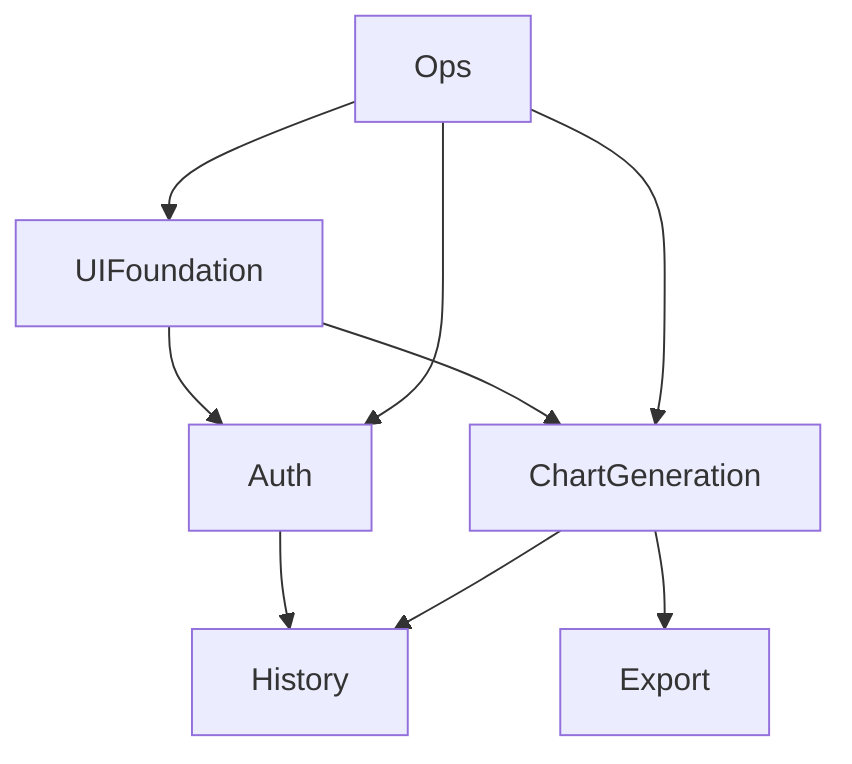

# Feature Map

| ID | Feature | Description | Dependency | Priority | Version |
|----|--------|------------|------------|----------|---------|
|000|UI Foundation|Design tokens, components, layout| - | High | 1.0.0 |
|001|Auth|Email registration & login|000 | High | 1.0.0 |
|002|Chart Generation|AI-driven prompt parsing and rendering|000,001 | High | 1.0.0 |
|003|History|Save & list charts|001,002 | Medium | 1.0.0 |
|004|Export|PNG/JPEG export|002,003 | Medium | 1.0.0 |
|005|Ops|Local dev (Postgres/Redis) + CI|all | High | 1.0.0 |

## Dependency Graph

## Iteration Plan
- Sprint A (2d): 000 + OPS bootstrap
- Sprint B (2d): 001
- Sprint C (3d): 002
- Sprint D (2d): 003
- Sprint E (1d): 004 + release prep

